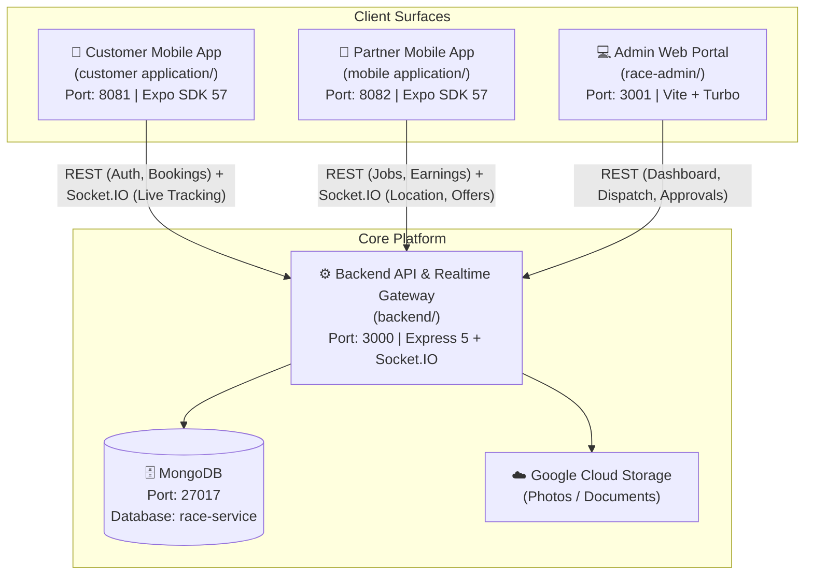
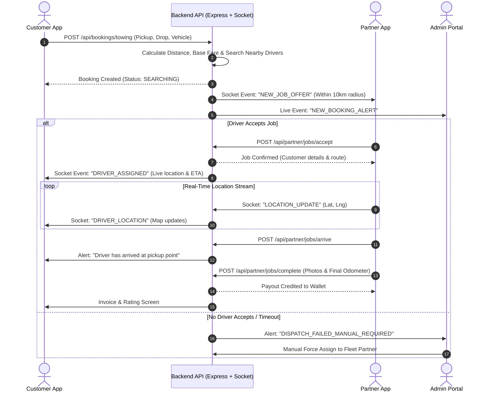

# RACE System Architecture & Platform Overview

> Comprehensive, point-by-point guide to the entire RACE platform ecosystem, its 4 active surfaces, interactions, lifecycles, and test credentials.

---

## 1. High-Level Ecosystem Diagram

---

## 2. Platform Surfaces & Purpose Comparison

| Surface | Target User | Primary Purpose | Tech Stack | Port / URL |
| :--- | :--- | :--- | :--- | :--- |
| **Customer App** `customer application/` | Vehicle Owners / General Public | Book emergency roadside towing, hire personal chauffeurs, track arrival on map, make payments. | Expo SDK 57 React Native 0.86 Zustand | `http://localhost:8081` *(Expo Go via Tunnel)* |
| **Partner App** `mobile application/` | Tow Truck Drivers, Chauffeurs, Fleet Vendors | Receive dispatch requests, accept/reject jobs, live navigation, upload proof of work, view daily earnings. | Expo SDK 57 React Native 0.86 Zustand | `http://localhost:8082` *(Expo Go via Tunnel)* |
| **Admin Web Portal** `race-admin/` | Operations Team, Dispatchers, Platform Admins | Manual dispatching, approve driver KYC/documents, view live fleet map, manage service tariffs, dispute resolution. | Vite + React 19 Tailwind + TanStack Turbo Monorepo | `http://localhost:3001` |
| **Backend API** `backend/` | Central Engine | Business logic, authentication, matching algorithms, socket event broadcasting, database persistence. | Express 5 TypeScript Socket.IO + Mongo | `http://localhost:3000` |

---

## 3. Core Features Breakdown

### A. Customer Mobile App
- **Phone OTP Authentication**: Fast login with mobile number verification.
- **Service Selection**:
  - **Towing Service**: Flatbed, hydraulic, or standard tow truck selection.
  - **Driver on Demand**: Hourly or trip-based personal chauffeur booking.
- **Pickup & Drop Location**: Google Places autocomplete + interactive pin placement.
- **Fare Estimation**: Instant upfront calculation based on vehicle type and distance.
- **Live Real-Time Tracking**: Watch assigned partner vehicle moving on map via WebSockets.
- **Payment & Invoicing**: Payment summary, digital invoices, and tipping.
- **Order History**: Review previous rides, breakdown logs, and receipts.

### B. Partner Mobile App (Drivers & Fleet Owners)
- **Role Modes**:
  - **Individual Driver**: Tow truck operator or chauffeur driver.
  - **Vendor / Fleet Owner**: Manage multiple drivers and registered trucks.
- **Online / Offline Toggle**: Drivers switch "Online" to become eligible for dispatching.
- **Real-Time Job Broadcast**: Audio alert + popup modal with distance, pickup point, and estimated payout.
- **Job Execution Workflow**:
  - Step 1: `Accept Job`
  - Step 2: `Arrived at Location`
  - Step 3: `Attach Vehicle / Start Trip` (includes photo upload)
  - Step 4: `Complete Drop-off` (includes odometer & signature)
- **Wallet & Earnings**: Daily/weekly earnings breakdown, payout requests, incentive tracking.
- **KYC & Document Upload**: Driving license, RC, insurance, and police verification upload.

### C. Admin Web Portal
- **Live Dispatch Dashboard**: Overview of ongoing, pending, and completed incidents across cities.
- **Manual Dispatch & Override**: Assign specific drivers or reassign stranded customers if automatic dispatch timeouts occur.
- **Driver / Partner Verification**: Document viewer to approve or reject submitted KYC details.
- **Pricing & Tariff Management**: Set base fares, per-kilometer charges, night surcharges, and cancellation fees.
- **Customer & Booking Records**: Full audit log of all bookings with status filters and customer search.

---

## 4. End-to-End Booking & Dispatch Flow

---

## 5. How They Communicate (Data Connection Model)

1. **REST APIs (`http://localhost:3000/api/...`)**:
   - Used for non-realtime operations: Login, OTP request, profile updates, fetching booking histories, and administrative settings.
2. **WebSocket Events (Socket.IO)**:
   - Used for low-latency events:
     - `driver:location`: Emitted by Partner App every 5 seconds when online; forwarded to Customer App.
     - `job:broadcast`: Sent to eligible nearby drivers when a booking is created.
     - `booking:status`: Notifies Customer App when driver reaches or completes trip.
3. **Storage & Assets (GCS / Local)**:
   - Customer profile avatars, vehicle breakdown photos, driver licenses, and vehicle inspection images.

---

## 6. Test Credentials & Quick Launch Reference

### Test Credentials
| Surface | Identifier / Login | Password / OTP | Purpose |
| :--- | :--- | :--- | :--- |
| **Customer App** | Mobile: `9876543210` | OTP: `123456` | General Customer account |
| **Partner App (Tow)** | Mobile: `8888880001` | OTP: `123456` | Verified Tow Truck Driver |
| **Partner App (Chauffeur)** | Mobile: `8888880002` | OTP: `123456` | Verified Personal Chauffeur |
| **Partner App (Vendor)** | Mobile: `9812345670` | OTP: `123456` | Fleet Owner Account |
| **Admin Portal** | Username: `admin` | Password: `admin` *(or bypass)* | Full Dispatch & Admin rights |

### Local Dev Port Map
- **Backend API**: `3000`
- **Admin Web**: `3001`
- **Customer App**: `8081` (Tunnel: `exp://tgvmfee-anonymous-8081.exp.direct`)
- **Partner App**: `8082` (Tunnel: `exp://bo69eok-anonymous-8082.exp.direct`)
